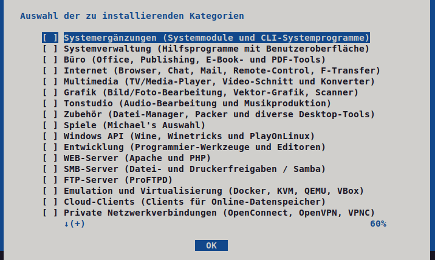
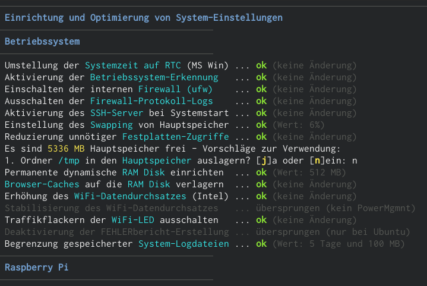

# Lissy - Linux System Setup Utility
<b>Lissy</b> ist das All-in-One-Tool und Swiss-Army-Knife für alle Debian-basierten Linux-Systeme. 
 
Dieses Skript ermöglicht die automatisierte <b>Installation von Programmpaketen</b> aus verschiedenen Quellen einschließlich der <b>Konfiguration</b> der Programme und Erstellung von Startern (Programmsymbolen) auf dem Desktop. 
Die zur Verfügung stehenden Programmpakete sind dazu in Kategorien geordnet, welche individuell aus- oder abgewählt und beliebig angepasst werden können. 
Zudem stehen diverse Optionen zur Verfügung, mit denen sich die Auswahl von Programmpaketen und der Ablauf des Skriptes individuell anpassen lassen. 
 
Auch die Installation nur eines einzelnen Programmpakets sowie das vollständige <b>Entfernen eines Programmpakets</b>, optional einschließlich seiner Konfiguration und sonstigen zugehörigen Daten, ist sehr einfach möglich - das Löschen zugehöriger Daten sogar noch für Programme, die nicht mehr installiert sind. 
 
Darüber hinaus können <b>weitere System-Komponenten</b> wie Treiber und Schriftarten installiert werden, sowie <b>zahlreiche Optimierungen</b> des Systems durchgeführt werden. 
 
Desweiteren können diverse <b>Reparaturen</b> des Systems durchführt werden - <b>Lissy</b> findet viele Fehler im System und repariert diese automatisch und interaktiv - angefangen vom Boot-Loader bis hin zu Paketquellen. 
 
Abgerundet wird der Funktionsumfang durch etliche <b>Bereinigungen</b> des Systems, bei denen veraltete und verwaiste Daten gefunden und entfernt werden können. 
 
<b>Lissy</b> ist kein kompiliertes Programm, sondern ein über viele Jahre gewachsenes Shell-Skript. Insofern kannst Du vollständig nachvollziehen, was <b>Lissy</b> tut und das Skript selbst nach deinen eigenen Vorstellungen verändern und optimieren. 

<b>WICHTIG</b>: Diese Software wird ohne Mängelgewähr und ohne jegliche ausdrückliche oder stillschweigende Garantie zur Verfügung gestellt, einschließlich und ohne Einschränkung jeglicher Garantie für die Gebrauchstauglichkeit oder Eignung für einen bestimmten Zweck. Alle Risiken in Bezug auf Ergebnisse und Leistung dieser Software werden vollständig vom Benutzer übernommen!

Weitere Infos, Screenshots und Anleitungen hier&nbsp;&raquo;&nbsp;<a href="https://migano.de/download/lissy/index.php">Lissy bei migano.de</a>.
 
