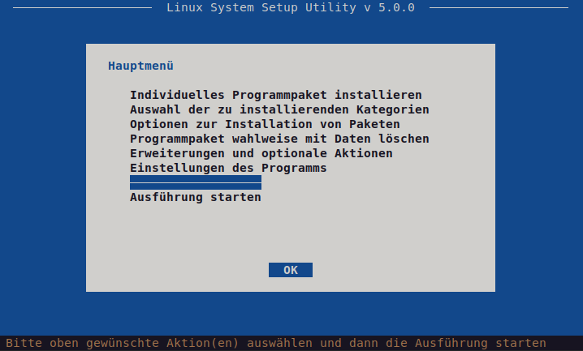
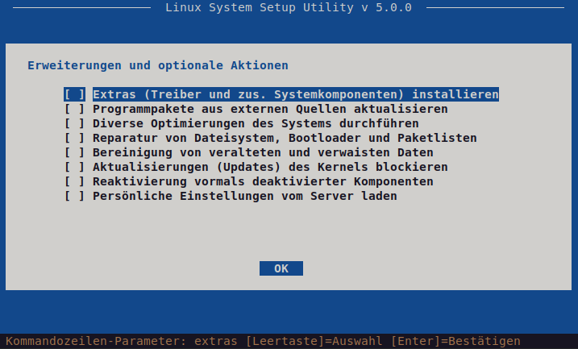
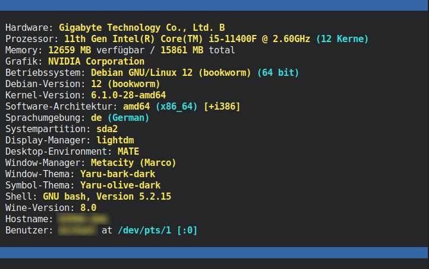

<b>Lissy</b> - Das All-in-One-Tool für alle Debian-basierten Linux-Systeme, optimiert für Ubuntu und Raspbian.
Dieses Skript ermöglicht die automatisierte Installation von Programmpaketen aus verschiedenen Quellen einschließlich der Konfiguration der Programme und Erstellung von Programmsymbolen (Startern) auf dem Desktop. Die zur Verfügung stehenden Programmpakete sind dazu in Kategorien geordnet, welche individuell aus- oder abgewählt und beliebig angepasst werden können. Zudem stehen diverse Optionen zur Verfügung, mit denen sich die Auswahl von Programmpaketen und der Ablauf des Skriptes individuell anpassen lassen.
Auch die Installation nur eines einzelnen Programmpakets sowie das vollständige Entfernen eines Programmpakets, optional einschließlich seiner Konfiguration und sonstigen zugehörigen Daten, ist sehr einfach möglich.
Darüber hinaus können weitere System-Komponenten wie Treiber und Schriftarten installiert werden, sowie zahlreiche Optimierungen des Systems durchgeführt werden. 
Lissy ist kein kompiliertes Programm, sondern ein über viele Jahre gewachsenes Shell-Skript. Insofern kannst Du vollständig nachvollziehen, was lissy tut und das Skript selbst nach deinen eigenen Vorstellungen verändern und optimieren.

<b>WICHTIG</b>: Diese Software wird ohne Mängelgewähr und ohne jegliche ausdrückliche oder stillschweigende Garantie zur Verfügung gestellt, einschließlich und ohne Einschränkung jeglicher Garantie für die Gebrauchstauglichkeit oder Eignung für einen bestimmten Zweck. Alle Risiken in Bezug auf Ergebnisse und Leistung dieser Software werden vollständig vom Benutzer übernommen!

Weitere Infos, Screenshots und Anleitungen hier&nbsp;&raquo;&nbsp;<a href="https://migano.de/download/lissy/index.php">Lissy bei migano.de</a>.
 
